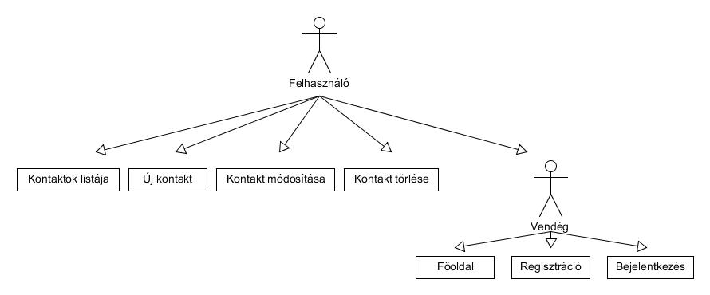
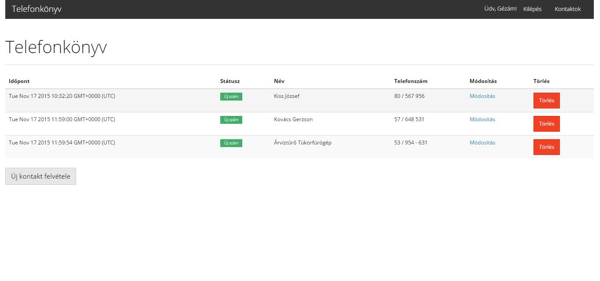
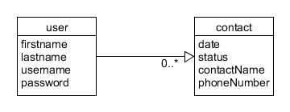
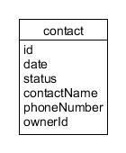

#Telefonkönyv

##Követelményanalízis

1. Követelmény feltárás

    - A programnak képesnek kell lennie nevekhez telefonszámot rendelni (kontakt), ezzel egy egyszerű, mégis felhasználóbarát telefonkönyvet létrehozva.
    - A telefonszámokat csak regisztrált felhasználók érhetik el.
    - A regisztráció mindenki számára legyen elérhető.
    - Felhasználó tudjon hozzáadni kontaktot az adatbázishoz.
    - Felhasználó tudja módosítani a hozzáadott kontaktokat.
    - A program tárolja a kontaktokkal történő eseményeket (létrehozás, utolsó módosítás).
    - Legyen lehetőség a program státuszának megadására, mellyel egy áttekinthetőbb, naprakészebb adatbázis állhat a felhasználók rendelkezésérendelkezésére.
        + Új szám
        + Feldolgozás alatt
        + Kész
        + Szám nem található
        + Téves szám
    - Az oldal könyen használható és átlátható legyen, bárki tudja elsőre is használni.

2. Használatieset-modell

    - Szerepkörök:
        + Vendég: Mindenki így kezdi használni az oldalt. Számára csak a főoldal, bejelentkezés és a regisztráció érhető el.
        + Felhasználó: A fentieken túl tudja használni az oldal minden funkcióját. Képes a kontaktok listázásra, új kontakt hozzáadására, meglévő módosítására, valamint törlésére.
    
    - Használati eset diagram:
        
    
    - Folyamatok:
        + Regisztráció
        + Bejelentkezés
        + Kontaktok listázása
        + Új kontakt hozzáadása (név, telefonszám)
        + Kontakt módosítása
            + Módosításkor az input mezőben az aktuális értékek jelennek meg, így telefonszám változtatáshoz nem szükséges új kontaktot felvinni.
        + Kontakt törlése
        
    - Új kontakt hozzáadásának kifejtése a regisztrációtól
        + A vendég státuszban lévő felhasználónak regisztrációja során meg kell adnia a következő adatokat
            + Vezetéknév
            + Keresztnév
            + Felhasználónév
            + Jelszó
        + Bejelentkezést követően a listaoldal nyílik meg a felhasználó előtt, aminek alján található az 'Új kontakt felvétele' gomb
        + Kattintás után új oldalon két input mezőben kell megadni a nevet és telefonszámot
        + A 'Hozzáad' gombra kattintva bekerül az adatbázisba a név és hozzátartozó telefonszám
            + Amennyiben nem töltöttük ki valamelyik mezőt hibeüzenetet kapunk
    
##Tervezés

1. Architektúra terv
    
    - Oldaltérkép
    
        + Vedég:
        
            - Főoldal
            - Regisztráció
            - Bejelentkezés
        
        + Felhasználó
        
            - Főoldal
            - Kontaktok listája
            - Új kontakt felvétele
            - Kontakt módosítása
            - Kontakt törlése

    - Végpontok
    
        GET / főoldal
        GET /login bejelentkező oldal
        POST /login bejelentkezési adatok felküldése
        GET /login/register regisztrációs oldal
        POST /login/register regisztrációs adatok felküldése
        GET /contacts/list kontkat lista oldal
        GET /contacts/new új kontakt felvitele
        POST /contacts/new új kontakt adatainak küldése
        GET /contacts/id kontkat adatai betöltése változatásra
        POST /contacts/id megváltoztatott adatok elküldése
        GET /delete/id kontakt törlése

2. Felhasználói felület

    - Designterv
    
    
3. Osztálymodell

    - Adatmodell
    
    
    - Adatbázisterv
    
    
##Implementáció

1. Fejlesztői környezet
    
    - A projekt elkészítéséhez a Cloud9 (c9.io) webes IDE-t használtam. Regisztráció nem szükséges, amennyiben van github accountunk azzal is beléphetünk. Új projektet idítva egy linuxos workspace-t kapunk a szolgáltatótól, amin lényegében bármit futtathatunk. Az egyszerűség kedvéért projekt létrehozásakor lehet választani, hogy legyenek-e előretelepített csomagok. Jelen esetben a NODE.JS-t célszerű kiválasztani, azonban terminálból is telepíthetjük.

2. Könyvtárstruktóra bemutatása
    
    - config: Waterline konfiguráció. Adatbázis absztrakciós réteg
    - controllers: Lehetne routernek is nevezni. Az itt található fájlok irányítják a lekérdezéseket és küldik az adatokat.
    - models: Adatbázis modellek
    - node_modulse: A node-hoz letöltött modulok, mellyek segítik a rendszer felépítését, működését.
    - public: Tartalmazza a libeket, js fájlokat.
    - views: Az egyes oldalak kinézetéért felelős hbs fájlokat tartalmazza.

##Felhasználói dokumentáció

1. Szoftver
    - Az oldal a gyakori operációs rendszereken futtatott népszerű böngészőin gond nélkül fut. Nem árt a legfrissebb verziót használni mindből, valamint kikapcsolni a javascript blokkolást amennyiben be van kapcsolva.

2. Hardver
    - Az oldal a ma használatos számítógépeken gond nélkül elfogadható sebességgel fut.

3. Használat
    - Az oldalt felhasználóbarát és letisztult kialakításának köszönhetően bárki az első használat alkalmával könnyedén kiismerheti és gond nélkül tudja használni.

4. Telepítés
    - A használathoz nem szükséges külön telepítés, azonban ha mégis szeretné a felhasználó letölteni az oldal forrását az alábbi linken eléri:
        + https://github.com/kozmate/nevjegy-bead
        + Jobb oldalt a 'clone in desktop' vagy a 'download zip' gombok segítségével lehet letölteni.
        + Hozzáértőbb felhasználók használhatják a git clone https://github.com/kozmate/nevjegy-bead parancsot